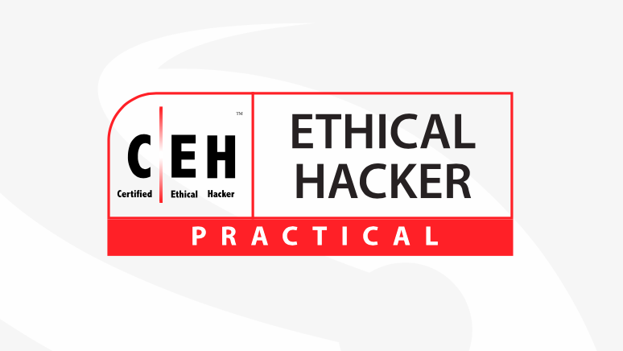

  {:.circle.shadow}

## $whoami
Hello and welcome to my website! I'm Achint, an aspiring Red Teamer with a passion for all things related to cybersecurity and information security. Currently, I work as a Security Analyst, my core interest lies in the fascinating world of network security, infrastructure protection, and physical security. In addition to my day-to-day responsibilities, I love tinkering with technology and developing unique tools that can help with day to day tasks. These tools not only satisfy my curiosity but also allows me to contribute to the community. Feel free to reach me out on Twitter [@A3h1nt](https://twitter.com/A3h1nt) to discuss anything security.

## $Certificates

  

    

     
    

  

   

    

     
    

  

   

    

     
    

  

## $Listening To
<iframe id="embedPlayer" src="https://embed.music.apple.com/us/album/udaan-original-motion-picture-soundtrack/1129427946?app=music&amp;itsct=music_box_player&amp;itscg=30200&amp;ls=1&amp;theme=auto" height="450px" frameborder="0" sandbox="allow-forms allow-popups allow-same-origin allow-scripts allow-top-navigation-by-user-activation" allow="autoplay *; encrypted-media *; clipboard-write" style="width: 100%; max-width: 854px; overflow: hidden; border-radius: 10px; transform: translateZ(0px); animation: 2s ease 0s 6 normal none running loading-indicator; background-color: rgb(228, 228, 228);"></iframe>

